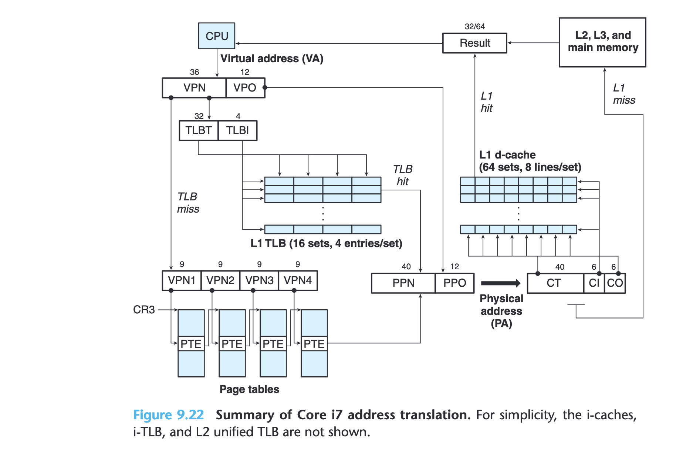
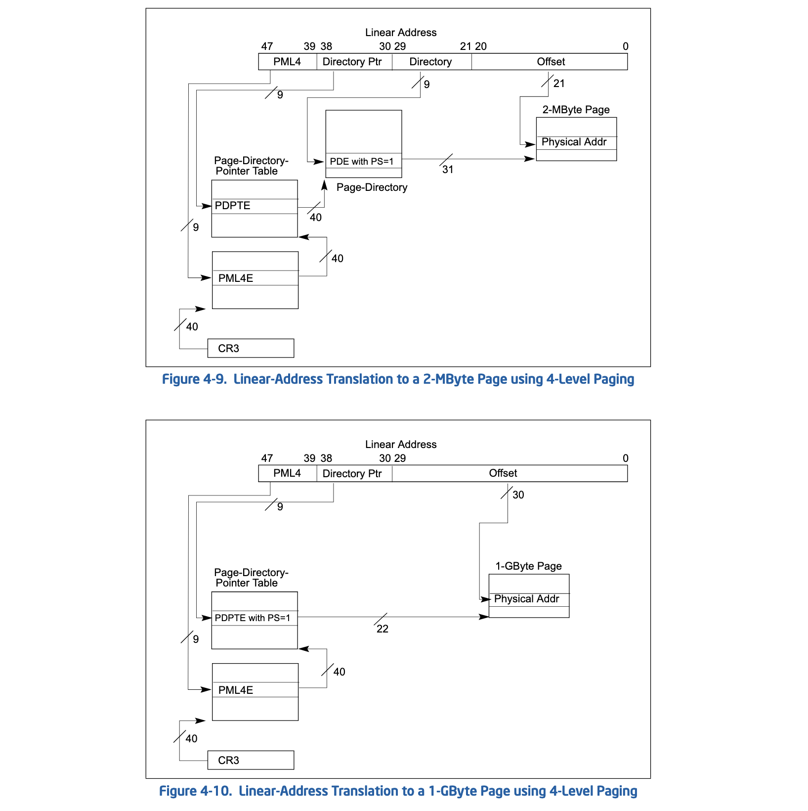

## Single-Producer Multiple-Consumer Bounded Buffer
```bash
$ make check_huge_pages_info
cat /proc/meminfo | grep Huge
AnonHugePages:         0 kB
ShmemHugePages:        0 kB
FileHugePages:         0 kB
HugePages_Total:       0
HugePages_Free:        0
HugePages_Rsvd:        0
HugePages_Surp:        0
Hugepagesize:       2048 kB
Hugetlb:               0 kB
$ make enable_huge_pages
echo 128 | sudo tee /proc/sys/vm/nr_hugepages
128
echo `id -g mark` | sudo tee /proc/sys/vm/hugetlb_shm_group
1001
$ make all
$ ./shm_bbuffer_spmc_kline
Usage:
./shm_bbuffer_spmc_kline producer shm_key capacity
./shm_bbuffer_spmc_kline consumer shm_id capacity
$ ./shm_bbuffer_spmc_kline producer 1234 10
Message received: {"e":"kline","E":1734255588017,"s":"BTCUSDT","k":{"t":1734255540000,"T":1734255599999,"s":"BTCUSDT","i":"1m","f":4273836662,"L":4273837179,"o":"102070.35000000","c":"102059.72000000","h":"102070.35000000","l":"102059.71000000","v":"5.23413000","n":518,"x":false,"q":"534233.83694960","V":"0.41164000","Q":"42012.14866260","B":"0"}}
Event time: UTC: 2024-12-15 09:39:48.017
Symbol: BTCUSDT
Kline data:
  Start time: UTC: 2024-12-15 09:39:00.000
  Open: 102070.35000000
  High: 102070.35000000
  Low: 102059.71000000
  Close: 102059.72000000
  Volume: 5.23413000
  Is kline closed: 0

...
$ # on another terminal
$ ipcs -m
------ Shared Memory Segments --------
key        shmid      owner      perms      bytes      nattch     status
0x004742cc 0          postgres   600        56         6
0x000004d2 15         mark       600        4112       1
$ ./shm_bbuffer_spmc_kline consumer 15 10  # you can launch multiple consumers
...
$ # on another terminal
$ make check_huge_pages_info
cat /proc/meminfo | grep Huge
AnonHugePages:         0 kB
ShmemHugePages:        0 kB
FileHugePages:         0 kB
HugePages_Total:     128
HugePages_Free:      127
HugePages_Rsvd:        0
HugePages_Surp:        0
Hugepagesize:       2048 kB
Hugetlb:          262144 kB
```

## Huge Pages
How does the CPU simultaneously support address translations of multiple page sizes (e.g., both 4KB & 2MB pages)? Using the PS bit in the multi-level page table entries! When we `mmap()` a segment of huge pages (pagesz=2MB), the kernel sets PS=1 for those page directory entries (PDEs), which will cause the page table walk to skip the fourth level.

How does it work with TLB then? For a given virtual address (VA), it will first cause a cold page walk, during which the CPU knows the page size that the VA references (PDE PS=1?) and caches the (31-bit or 40-bit) PFN for the VPN. The TLB entry can use some bits for identifying different page sizes supported by the CPU (e.g., 2 bits for 4KB, 2MB, 1GB pages).  Next time the same VA (or another VA in the same page) is translated, the CPU uses the corresponding VPN bits for comparison:
- entry page size is 4KB, compare the stored 36-bit VPN with VA[47:12]
- entry page size is 2MB, compare the stored 27-bit VPN with VA[47:21]

If a comparison succeeds, the corresponding stored (40-bit or 31-bit) FPN is retrieved. Note that the physical cache works independent of page sizes. It can always use the lower 12 bits for indexing. So, to match the translated PFN to any of the 8 cache tags (40-bit PFNs), the translated FPN needs to be appended with VA[20:12] if the page size is 2MB.

How about TLB indexing? VA[20:12] can still be used for indexing 2MB pages. These bits are common to both 4 KB and 2MB pages and using them simplifies TLB indexing.



